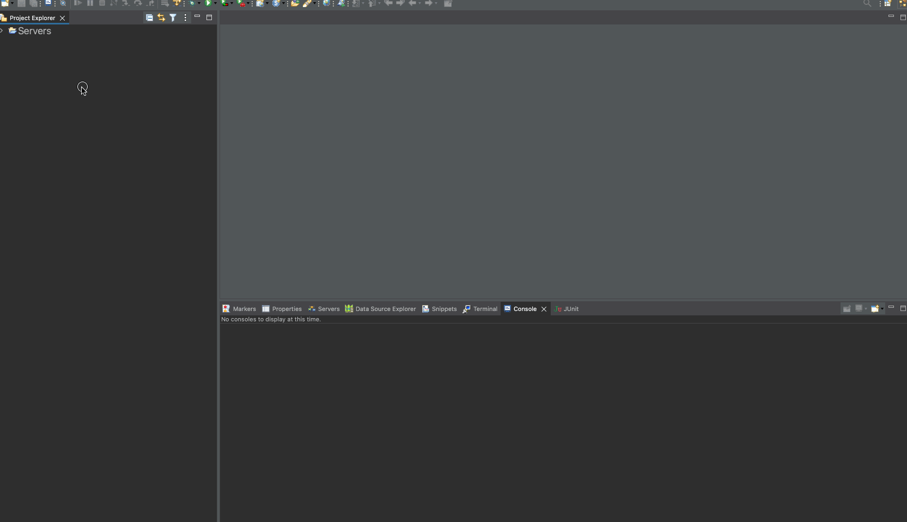

# Distributed-System-for-Ski-Sports-Industry

This project involves implementing a client/server based distributed architecture using a free tier cloud virtual machine. The server will be running on Jetty and will handle resource open API design for an audio item that includes properties such as Artist Name, Track Title, and Number of Copies Sold. The open APIs for GET and POST methods will be programmed using a Java program called Audio.java. 

The server side will use a Servlet to represent the audio resource and maintain a sum of the total number of copies sold for all the audio items in the database. The server will be multithreaded with a thread pool execution. The to-do also involves programming a test class to simulate concurrent requests from multiple clients, recording the round-trip time, and plotting a line chart to represent the time taken for each request versus the number of clients.

### Import To Eclipse Java EE Edition

1. Download the zip of this repo and unzip it.

2. Import the project into eclipse as a maven project.

   

3. Config Run for development.

   

4. Config Run for Deployment

   

5. Access servlet.

   

   As you have the servlet at `org.example.controller.HelloServlet.java`.


### CMD

#### To develop the project.

``` bash 
mvn jetty:run
```

> The server config for development is at `pom.xml:86`.
>
> Feel free to configure it.


#### To deploy the project.

``` bash
mvn clean install exec:exec
```
> The server config for deployment is in `org.example.EmbeddingJettyStarter`.
>
> Feel free to configure it.


### Configuration of Jetty

#### Configure in coding

In `org.example.EmbeddingJettyStarter`, you can directly change the port or the context path by:

``` java
Server server = new Server(8080);		// change the port number 
// ...
context.setContextPath("/new_context");   // change the context path
// ...
```

Then you can access the servlet by:

http://localhost:8080/new_context/HelloServlet

At the same time, please make sure your servlet's annotation value mapping is valid for the context path:

``` java
@WebServlet(name = "HelloServlet", value = "HelloServlet")
```

Do not add the root in the front:

``` java
@WebServlet(name = "HelloServlet", value = "/HelloServlet")
```
